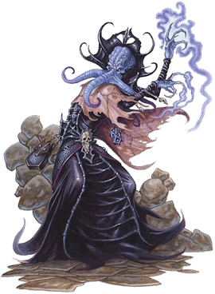
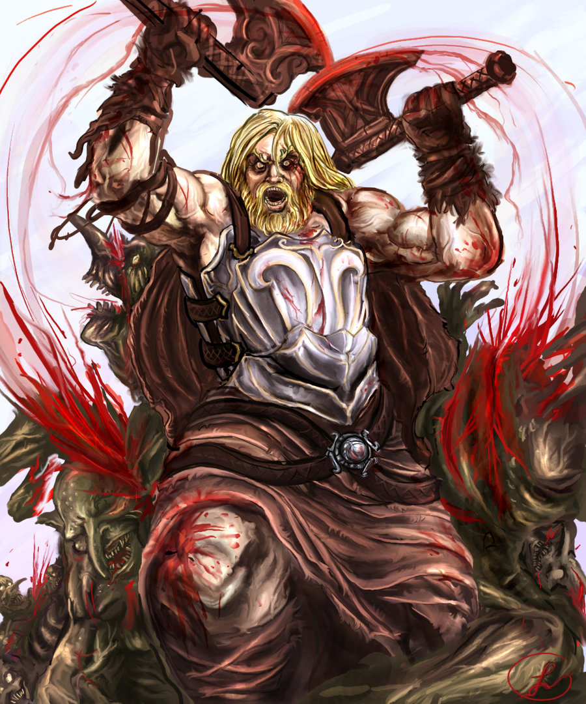
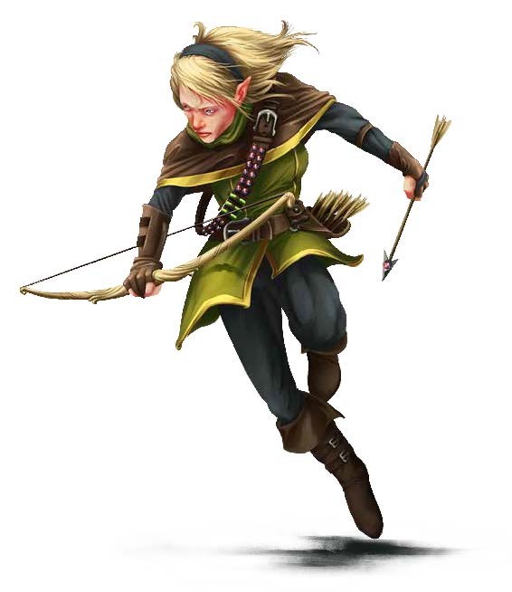
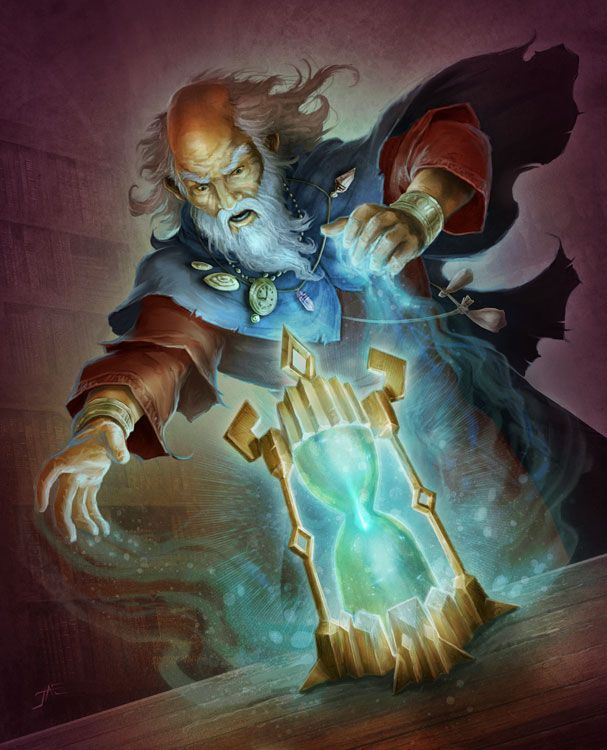

# Aloitukset

Peli alkaa maailmanlopun tavernasta jonne pelihahmo on jollain ilveellä päätynyt. Erilaisia hahmoja on neljä

## Amo

Pelottava ja satoja uosia vanha mindflayer. Onnistuu juuri ja juuri pakenemaan mindflayereiden maanalaisesta kaupungista maan pinnalle. Vaikka onkin heikossa kunnossa, tietää että maahiset ovat alkamassa kehittämään sotaa pinnalla asuvia kohtaan ja tämä hän haluaa estää. Ikä n. 259 vuotta

## Waargh

Julmista barbaareista julmin. Häädetty pois klaaninsa luota koska tappoi klaanin toteemieläimen, valkoisen albiinonkarhun painiottelussa. Etsii korvaavaa eläintä heimonsa palvottavaksi. Lämpenee tulikuumaksi taistellessaan. Aseena lihaksien lisäksi taistelukirves. Ikä 37 vuotta.

## String

Jousiampuja joka tällä hetkellä on maanpaossa. Hänen häissään joku teloitti vaimon lisäkse vaimon suvun silmäätekeviä ruhtinaita ja String otettiin heti syylliseksi. Haluaa löytää oikean murhaajan ja kostaa. Erikoisisku: viiden nuolen ampuminen yhdellä laukauksella. Rodultaan String on metsähaltija ja sen tähden näkee myös pimeässä. Ikä 26 vuotta.

## Janus kaksinaama

Erittäin voimakas maagi ja muodonmuuttaja. Aikaa seuraamalla näkee miten isot pyörät ovat pyörimässä ja itse kunkin on valittava puolensa. Voi muuttaa muotoaan käärmeeksi. Ikä n. 500 vuotta, mahdollisesti ihminen Zarovan järven laidalla sijainneesta kylästä. Pystyy lumoamaan kaikkia eläintä kehittyneempiä elämänmuotoja.
